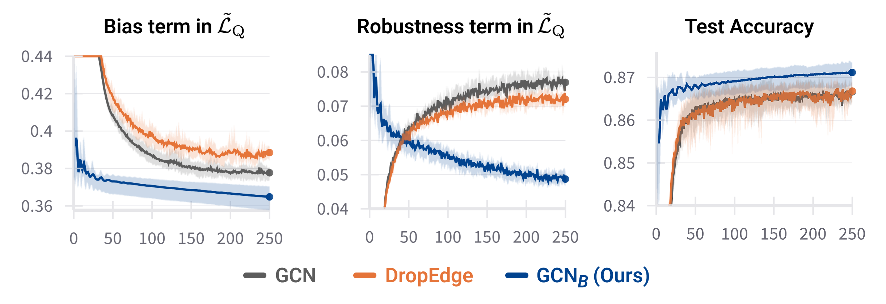
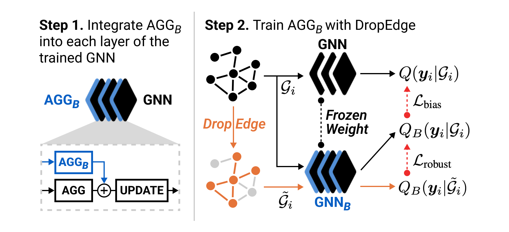

# Aggregation Buffer: Revisiting DropEdge with a New Parameter Block

Code for [Aggregation Buffer: Revisiting DropEdge with a New Parameter Block](https://arxiv.org/abs/2505.20840) by Dooho Lee, Myeong Kong, Sagad Hamid, Cheonwoo Lee and Jaemin Yoo.

## Overview

#### Unexpected failure of DropEdge in Optimizing Robustness

<p align="center">
  <br />
  
  <br />
</p>

#### Aggregation Buffer(AGG<sub>B</sub>) and Its Training Scheme

<p align="center">
  <br />
  
  <br />
</p>

## Docker Setup

A Dockerfile is provided for containerized execution.

#### Build the image

```bash
docker build -t gnn_buffer .
```

#### Launch an interactive container (with GPU support)

```bash
docker run --gpus all -v $(pwd):/app -it gnn_buffer bash
```

These commands launch a Docker container equipped with necessary dependencies. You can execute training and evaluation scripts within this container.

## Datasets

Most datasets are downloaded automatically. However, the filtered versions of the Chameleon and Squirrel datasets must be manually acquired: (1) Download `filtered.npz` for each dataset from [this repository](https://github.com/yandex-research/heterophilous-graphs/tree/main/data). (2) Place the downloaded files in `dataset/` at the project root.

## Usage

We propose a two-step training scheme in our paper:

1. Train a GNN without DropEdge using `train/train_gnn.py`.
2. Integrate AGG<sub>B</sub> into the pre-trained GNN layers and train only the AGG<sub>B</sub> parameters with DropEdge, keeping all other parameters frozen. This is done using `train/train_buffer.py`.

After executing `train/train_gnn.py`, the trained GNN weights will be saved in the `results/` directory. The script `train/train_buffer.py` will then load these weights to integrate and train the AGG<sub>B</sub> module.

You can specify the dataset using the `--dataset` argument. A detailed description of all configurable arguments is available in `utils/arg_parser.py`. Hyperparameter configurations are primarily loaded from the corresponding JSON files in the `configs/` directory based on the specified dataset. These configuration files take precedence over command-line arguments, so please ensure they are correctly set.

For reproducibility, example scripts used in our experiments are provided in the `scripts/` directory:

```
./scripts/cora.sh
```

## Citation

If you find our work useful, please cite the following:

```BibTeX
@misc{lee2025aggregationbufferrevisitingdropedge,
      title={Aggregation Buffer: Revisiting DropEdge with a New Parameter Block},
      author={Dooho Lee and Myeong Kong and Sagad Hamid and Cheonwoo Lee and Jaemin Yoo},
      year={2025},
      eprint={2505.20840},
      archivePrefix={arXiv},
      primaryClass={cs.LG},
      url={https://arxiv.org/abs/2505.20840},
}
```

## Contact

For questions or feedback, please open an issue in this repository or contact dooho@kaist.ac.kr.
